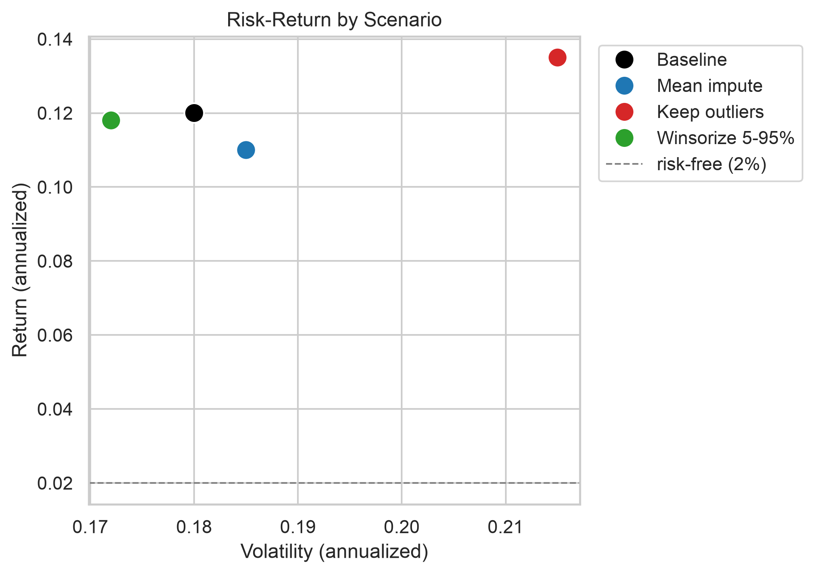
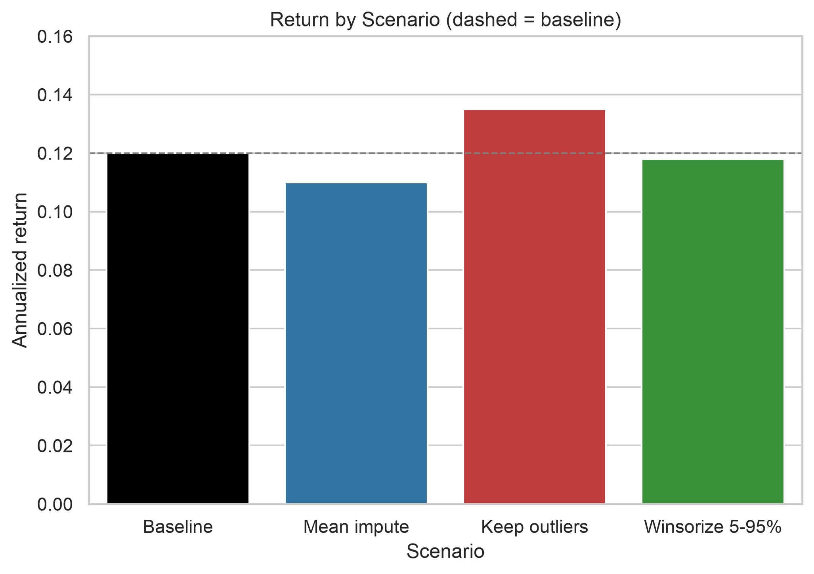
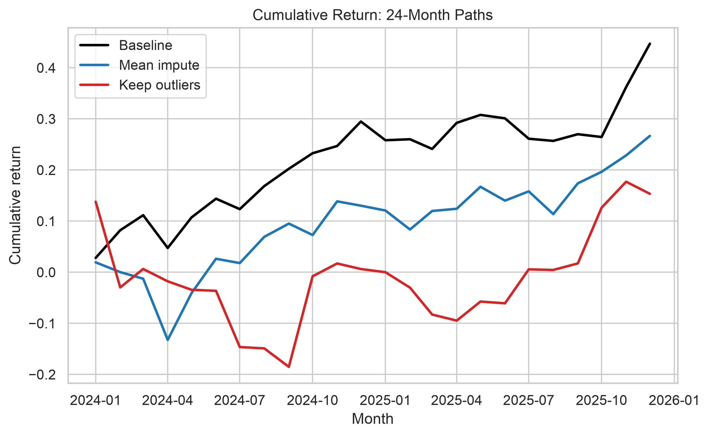
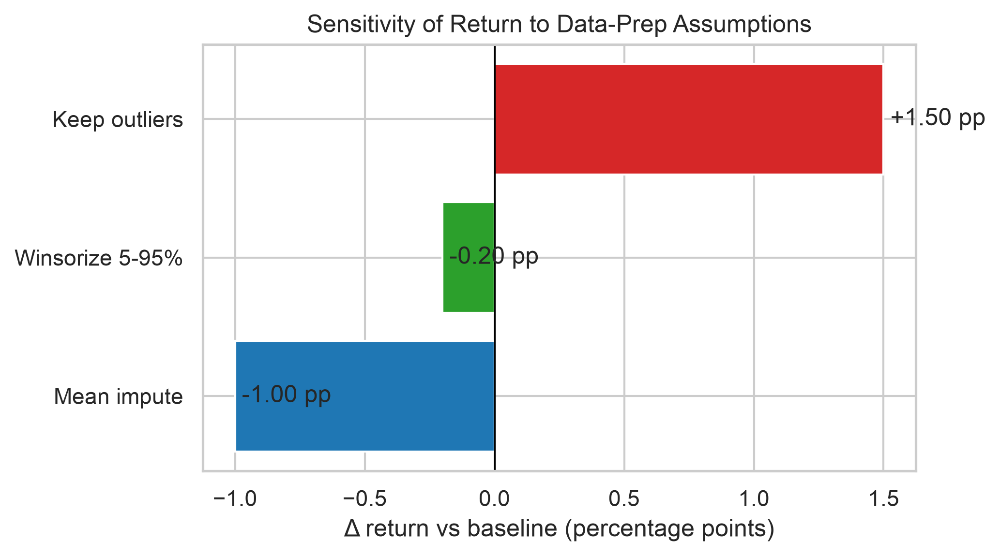

# Investment Strategy Risk–Return Review

**Prepared for:** the investment committee (non-technical audience)
**Scope:** how data-preparation assumptions change the strategy's reported return, risk, and Sharpe ratio.

---

## Executive Summary

- The strategy's risk-adjusted return (**Sharpe ≈ 0.56**) is real but modest, and it is **more sensitive to
  how outliers are handled than to how missing data is imputed**.
- **Keeping outliers** makes headline return look **1.5 pp higher** (13.5% vs 12%), but volatility jumps
  **3.5 pp** — so risk-adjusted, it is actually slightly *worse* than the baseline.
- Quote the **conservative baseline** (median impute + 3σ outlier trim); treat any return above ~12% with
  skepticism, since it usually reflects loose outlier handling rather than a better strategy.

---

## Chart 1 — Risk–Return by Scenario

**What it shows:** each point is one data-preparation assumption. Higher is more return; further right is
more risk. The dashed line is the risk-free rate (2%).

**Takeaway:** "Keep outliers" is the highest-return *and* highest-risk point, while "Winsorize 5–95%" is
tamer. Higher headline return is being paid for with meaningfully more risk, and the risk-adjusted
trade-off barely moves.

---

## Chart 2 — Return by Scenario

**What it shows:** annualized return under each assumption, with the dashed line marking the baseline
(12%).

**Takeaway:** the reported return is not a single truth — it shifts by up to **2.5 percentage points**
across equally defensible data-prep choices (mean impute −1.0 pp, keep outliers +1.5 pp, winsorize −0.2 pp).

---

## Chart 3 — Cumulative Return Over 24 Months

**What it shows:** simulated 24-month paths for three of the scenarios.

**Takeaway:** the "Keep outliers" path is visibly the **bumpiest ride** — deeper dips and sharper spikes,
even though it ends slightly higher. The smooth-looking baseline partly reflects trimming extreme months;
the un-trimmed reality is choppier than the headline volatility number conveys.

---

## Sensitivity — Δ from Baseline

| Scenario | Return | Volatility | Sharpe | Δ Return (pp) | Δ Vol (pp) |
|---|---|---|---|---|---|
| **Baseline** (median impute, 3σ trim) | 12.0% | 18.0% | 0.56 | — | — |
| Mean impute | 11.0% | 18.5% | 0.49 | −1.0 | +0.5 |
| Keep outliers | 13.5% | 21.5% | 0.53 | +1.5 | +3.5 |
| Winsorize 5–95% | 11.8% | 17.2% | 0.57 | −0.2 | −0.8 |

**Reading it:** the outlier rule is the dominant lever — it moves volatility by up to 3.5 pp. Imputation is
a much smaller lever (−1.0 pp return). The Sharpe ratio is highest under winsorizing (0.57) and lowest
under mean imputation (0.49).

---

## Assumptions & Risks

**Assumptions**

1. Returns are roughly stationary over the 24-month window — no regime change.
2. The baseline's 3σ trim removes only genuinely extreme months, not real signal.
3. Missing values are imputed with the median (robust to the very outliers being trimmed).
4. Return and volatility are annualized consistently across all scenarios.

**Risks**

- If the outliers are **genuine** (a real crash or spike) rather than data errors, trimming them
  **understates the tail risk** the committee should be pricing.
- If the missingness is **not at random**, the median imputation quietly biases the baseline.
- The 24-month window is **short** — the annualized numbers carry wide sampling uncertainty that a single
  point estimate hides.

---

## Decision Implications — "What this means for you"

- **Quote the conservative baseline** (median impute + 3σ trim). It is the most defensible number and the
  least likely to overstate performance.
- **Treat any return above ~12% with skepticism** — it usually means loose outlier handling is inflating the
  headline rather than improving the strategy.
- **Budget for the un-trimmed reality.** The "Keep outliers" path shows the ride is choppier than the
  baseline volatility suggests; size positions for the higher-volatility scenario, not the trimmed one.
- **Next step:** re-run over a longer window with a formal regime check before committing capital.
