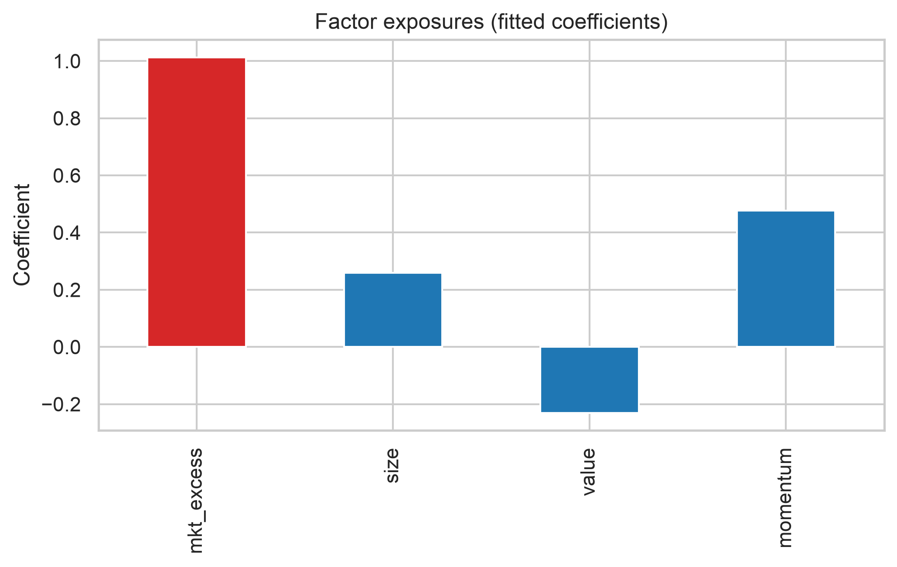
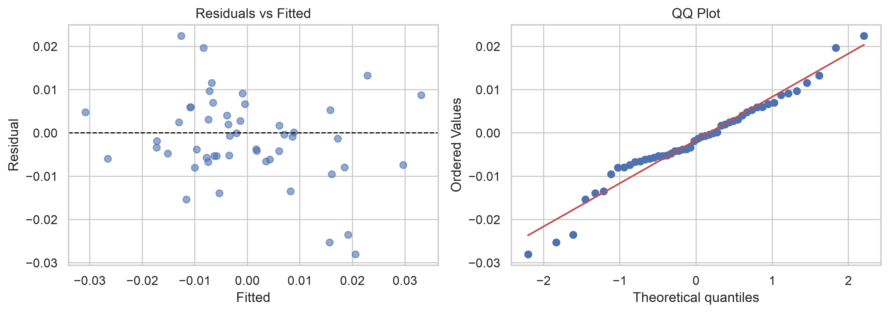
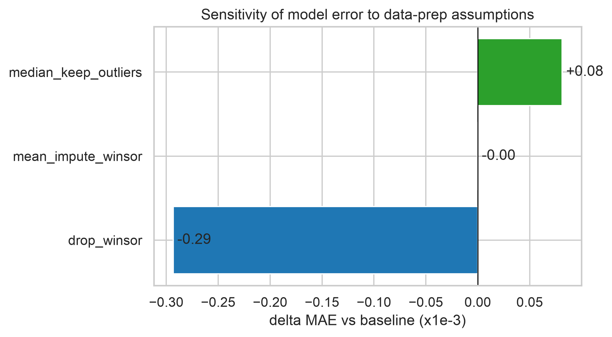

# Portfolio Factor-Model Review

**Prepared for:** the portfolio manager (non-technical audience)
**Scope:** what drives the portfolio's excess return, how well the model captures it, and how much the
answer changes with data-handling assumptions.

---

## Executive Summary

- The **market factor is the dominant driver** of the portfolio's excess return; size, value, and momentum
  add a smaller, secondary contribution.
- The model **recovers the factor exposures well**, but its estimate is **more sensitive to the outlier
  treatment than to imputation** — the headline number should carry a range, not a point.
- The conservative baseline (median impute + cap outliers) is the right number to quote; looser outlier
  handling can make the model look better without improving it.

---

## Chart 1 — Factor exposures

**What it shows:** the fitted factor exposures (coefficients) from the linear model, with the market
factor highlighted.

**Takeaway:** market exposure dominates, which means the model's forecast is mostly a bet on the market
direction — the other factors refine it, not replace it.

---

## Chart 2 — Residual diagnostics

**What it shows:** residuals vs. fitted values (left) and a Q-Q plot (right).

**Takeaway:** residuals are roughly centered and symmetric, with slightly heavy tails (the noise is
heteroskedastic — larger in high-volatility periods). The model is reasonable but should not be trusted for
precise tail predictions.

---

## Chart 3 — Sensitivity to assumptions

**What it shows:** how far the model error (MAE) moves from the baseline under alternative data-prep
choices.

**Takeaway:** the **outlier rule** is the bigger lever than imputation — the reported quality of the model
moves with it, so the choice must be stated explicitly.

---

## Assumptions & Risks

**Assumptions**

1. The relationship is linear (plus the small momentum-squared term), and returns are roughly stationary.
2. The 5% missing values are missing at random and the median is a fair fill.
3. The two momentum spikes are noise, not genuine events, so capping them is appropriate.

**Risks**

- If the momentum spikes are **real**, capping them hides tail risk.
- If the missingness is **not at random**, the median fill quietly biases the result.
- The window is short (~1 year), so the estimate carries wide sampling uncertainty.

---

## Decision Implications — "What this means for you"

- **Quote the conservative baseline**, and report a range, not a single number.
- **Treat the model as a market-direction tool** — its main input is the market factor.
- **Monitor for drift** (see `docs/monitoring_plan.md`) before relying on it live.
